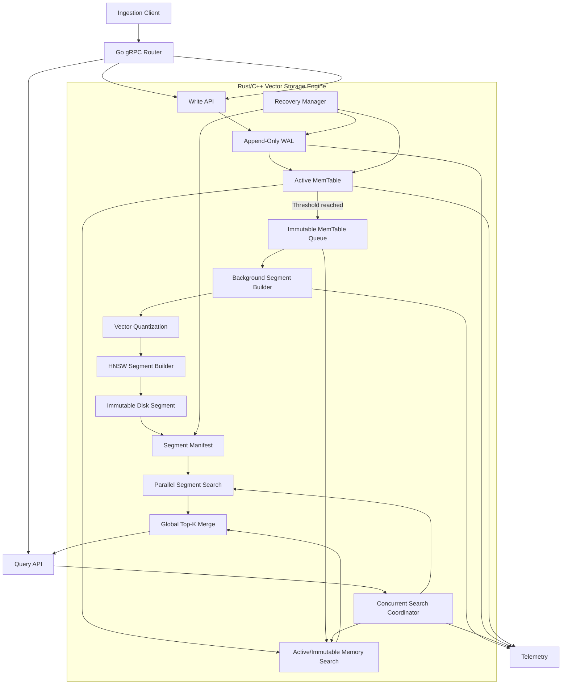

# ARCHITECTURE — PS-005 Dynamic Inverted-HNSW Vector Storage Engine

## 1. Architecture Overview

PS-005 requires a storage architecture that separates high-throughput ingestion from expensive persistent vector-index construction.

The selected architecture is an **LSM-inspired vector storage engine**.

The central design is:

```text
                    ┌──────────────────────┐
                    │     Go gRPC Router   │
                    └──────────┬───────────┘
                               │
                  ┌────────────┴────────────┐
                  │                         │
                WRITE                     QUERY
                  │                         │
                  ▼                         ▼
          ┌──────────────┐          ┌──────────────┐
          │ WAL Writer   │          │ Query Router │
          └──────┬───────┘          └──────┬───────┘
                 │                         │
                 ▼                         │
          ┌──────────────┐                 │
          │ Active       │◄────────────────┤
          │ MemTable     │                 │
          └──────┬───────┘                 │
                 │                         │
          threshold reached                │
                 │                         │
                 ▼                         │
          ┌──────────────┐                 │
          │ Immutable    │◄────────────────┤
          │ MemTable     │                 │
          └──────┬───────┘                 │
                 │                         │
          background flush                 │
                 │                         │
                 ▼                         │
          ┌──────────────┐                 │
          │ Segment      │                 │
          │ Builder      │                 │
          └──────┬───────┘                 │
                 │                         │
                 ▼                         │
          ┌──────────────┐                 │
          │ Quantized    │                 │
          │ HNSW Segment │◄────────────────┤
          └──────────────┘                 │
                                            │
                                            ▼
                                  ┌─────────────────┐
                                  │ Top-K Aggregator │
                                  └────────┬────────┘
                                           │
                                           ▼
                                       Response
```

The architecture deliberately avoids requiring all vectors to exist inside one continuously mutated HNSW graph.

---

## 2. Source-Grounding

### Problem-Statement Facts

PS-005 explicitly requires/proposes:

- LSM architecture
- WAL
- In-memory MemTable
- Immutable quantized vector segments
- Concurrent search across active memory and disk segments
- Dynamic top-k merging
- Rust/C++ storage engine
- Go gRPC router
- TypeScript telemetry
- >50K vectors/s
- 2K queries/s
- P99 <15 ms

### Official/Primary Technical Evidence

RocksDB documents the established LSM pattern where writes enter an in-memory MemTable and WAL, full MemTables become immutable, and background processes flush immutable structures to persistent files. citeturn0search0turn0search4

The original HNSW paper describes HNSW as a hierarchical graph structure for approximate nearest-neighbor search using multiple proximity-graph layers. citeturn0academia24

### Engineering Judgment

Applying the LSM principle to vector indexes is appropriate because it allows the system to avoid requiring every ingestion event to mutate one globally shared persistent HNSW structure.

This is an engineering design decision for PS-005, not a claim that the proposed implementation will automatically meet the performance targets.

---

## 3. System Flow



---

## 4. Component Architecture

## 4.1 Go gRPC Router

### Responsibility

Provide the external service boundary.

Responsibilities:

- Accept ingestion requests
- Accept search requests
- Validate basic request structure
- Route requests to storage engine
- Expose stable gRPC contracts
- Return responses/errors
- Collect/request telemetry where appropriate

### Inputs

- Vector ID
- Vector values
- Query vector
- k
- Optional request parameters

### Outputs

- Write acknowledgement
- Search results
- Error status

### Dependency

Storage-engine service interface.

---

## 4.2 WAL

### Responsibility

Provide crash-recovery information for accepted writes.

### Design

Use append-only records.

Each record should contain sufficient information to reconstruct the logical vector write.

Suggested logical fields:

```text
Record Type
Sequence Number
Vector ID
Dimension
Vector Payload
Checksum
```

Exact binary layout should be finalized during implementation.

### Invariant

A write cannot be considered durable under the chosen durability mode unless the corresponding WAL durability requirement has been satisfied.

### Engineering Judgment

The WAL should be sequential and append-oriented because the workload is dominated by ingestion.

RocksDB similarly uses a WAL alongside its in-memory write structure for recovery. citeturn0search0turn0search8

---

## 4.3 Active MemTable

### Responsibility

Store the newest vectors while accepting new writes.

Requirements:

- Concurrent insertion/search
- Bounded memory
- Fast vector access
- Clear ownership/lifecycle
- Safe transition to immutable state

### Important Design Principle

Do not interpret "lock-free" as automatically meaning "correct or faster."

The implementation should minimize contention and use appropriate concurrency primitives based on benchmark evidence.

The final implementation may use:

- Sharded structures
- Per-shard synchronization
- Atomic publication
- Immutable snapshots
- Lock-free queues

depending on profiling results.

---

## 4.4 Immutable MemTable

When an active MemTable reaches its configured threshold:

```text
ACTIVE
  ↓
SEALED
  ↓
IMMUTABLE
  ↓
BACKGROUND FLUSH
```

The immutable structure is no longer modified.

New writes go to a new active MemTable.

This is analogous to the immutable MemTable pipeline documented by RocksDB. citeturn0search0turn0search4

---

## 4.5 Segment Builder

### Responsibility

Convert immutable vector data into a persistent searchable segment.

Pipeline:

```text
Immutable MemTable
        ↓
Vector serialization
        ↓
Quantization
        ↓
HNSW construction
        ↓
Segment validation
        ↓
Atomic publication
```

### Important

Segment publication must be atomic from the perspective of readers.

A partially written segment must never become visible as a valid searchable segment.

---

## 4.6 Quantization

### Responsibility

Reduce persistent vector representation/storage cost while maintaining acceptable search quality.

The exact quantization method is an implementation decision.

Possible candidates include:

- Scalar quantization
- Product quantization
- Other appropriate fixed-width representations

Selection must be benchmark-driven.

### Validation

Compare:

```text
Unquantized baseline
vs
Quantized implementation
```

using:

- Recall@10
- Search latency
- Memory
- Disk size

No claim of superior efficiency or accuracy should be made before measurement.

---

## 4.7 HNSW Segment

Each immutable segment contains an HNSW search structure.

HNSW provides a hierarchical proximity-graph approach for approximate nearest-neighbor search. citeturn0academia24

### Properties

- Immutable after publication
- Independently searchable
- Loadable from disk
- Validatable
- Versioned/configured

### Why Immutable?

Once a segment becomes immutable:

- Queries do not need to coordinate with graph mutation.
- Background processing can operate on other structures.
- Readers can safely access the published structure.

---

## 4.8 Segment Manifest

The manifest describes currently valid segments.

Suggested metadata:

```text
Segment ID
Generation
Minimum Sequence Number
Maximum Sequence Number
Vector Count
Dimension
Distance Metric
Quantization Type
HNSW Parameters
File Paths
Checksum
Creation Time
Format Version
```

The manifest must support safe publication/recovery.

---

## 4.9 Search Coordinator

### Responsibility

Execute one logical query across all relevant searchable structures.

Flow:

```text
Query
  ↓
Active MemTable
  ↓
Immutable MemTables
  ↓
Immutable Disk Segments
  ↓
Candidate results
  ↓
Global top-k merge
  ↓
Final results
```

The coordinator should avoid holding a global write lock during search.

---

## 4.10 Top-K Aggregator

Each searchable layer produces local candidates:

```text
Segment A → top-k
Segment B → top-k
Segment C → top-k
MemTable  → top-k
```

The aggregator combines these into:

```text
Global top-k
```

For k=10, the implementation should maintain only the candidates necessary to calculate the final top-10 rather than materializing every vector result.

---

## 4.11 Recovery Manager

Recovery sequence:

```text
Process Start
     ↓
Read Manifest
     ↓
Validate Segments
     ↓
Identify Durable Segment Sequence
     ↓
Read WAL
     ↓
Replay Unrepresented Records
     ↓
Reconstruct Active MemTable
     ↓
Expose Search
     ↓
Accept New Writes
```

Corrupt WAL records or invalid segments must be detected rather than silently accepted.

---

## 4.12 TypeScript Telemetry Interface

The TypeScript interface should expose operational state rather than become a second application.

Primary dashboard:

```text
┌────────────────────────────────────────────┐
│ Vector Storage Engine                      │
├──────────────┬──────────────┬──────────────┤
│ Writes/sec   │ Queries/sec  │ P99 Latency  │
├──────────────┼──────────────┼──────────────┤
│ WAL Size     │ MemTable     │ Segments     │
├──────────────┴──────────────┴──────────────┤
│ Ingestion / Query timeline                  │
├────────────────────────────────────────────┤
│ Segment / Flush state                      │
├────────────────────────────────────────────┤
│ Errors / Recovery / System status           │
└────────────────────────────────────────────┘
```

---

# 5. Data / Storage Design

## Vector Record

Logical representation:

```text
VectorID
Dimension
VectorValues
SequenceNumber
```

Optional metadata should not be introduced unless required.

---

## WAL Record

```text
Header
Sequence Number
Operation
Vector ID
Dimension
Vector Data
Checksum
```

The actual binary representation should be versioned.

---

## Segment

Logical structure:

```text
Segment Header
Metadata
Vector IDs
Quantized Vector Data
HNSW Graph
Optional Auxiliary Structures
Checksum
Footer
```

---

## Manifest

The manifest is the authoritative index of published segments.

It should support atomic updates so a crash cannot expose an incomplete segment publication.

---

## PostgreSQL Decision

> **PostgreSQL: Not required for this problem.**

The core workload is a specialized vector storage engine. Introducing PostgreSQL would add infrastructure without solving the core storage-engine problem.

---

## Redis Decision

> **Redis: Not required for the core MVP.**

The system itself is the storage engine being evaluated. Adding Redis would obscure the performance characteristics of the implementation.

---

## Vector Database Decision

> **External vector database: Not required for the core MVP.**

PS-005 specifically evaluates a dedicated vector storage engine architecture.

---

# 6. Core Interfaces

## Storage Engine

Conceptual interface:

```text
open(path)
close()

put(vector_id, vector)
put_batch(vectors)

search(query_vector, k)

flush()
recover()

stats()
```

Exact language-specific API will be defined during implementation.

---

## gRPC Interface

Conceptual operations:

```text
PutVector
PutVectors
Search
GetStats
Flush
Health
```

The final protobuf contract should remain minimal.

---

## Search Result

Logical result:

```text
VectorID
Similarity/Distance
```

Optional metadata should not be returned unless required.

---

# 7. Technology Decisions

## Decision 1 — Rust or C++ Storage Engine

### Selected

Rust or C++.

### Evidence

The problem statement explicitly mandates Rust or C++ for the storage engine.

### Reason

The storage engine requires:

- Low-level memory control
- High-throughput I/O
- Concurrency
- SIMD-friendly distance computation
- Explicit data-layout control

### Final Choice

**Rust is preferred unless existing team expertise or dependency requirements strongly favor C++.**

### Confidence

High for language constraint; Medium for final Rust-vs-C++ selection.

---

## Decision 2 — Go gRPC Router

### Selected

Go.

### Evidence

Explicit problem-statement requirement.

### Reason

Provides a clean external service boundary without mixing RPC concerns into the storage-engine implementation.

### Alternative

Expose the storage engine directly.

### Rejection Reason

Would not satisfy the specified Go query-router architecture and would couple external transport to the storage implementation.

### Confidence

High.

---

## Decision 3 — TypeScript Telemetry

### Selected

TypeScript.

### Evidence

Explicit problem-statement requirement.

### Reason

Provides a demonstrable operational interface for judges.

### Alternative

CLI-only monitoring.

### Rejection Reason

A CLI can provide metrics but offers weaker visual demonstration value for a live hackathon evaluation.

### Confidence

High.

---

## Decision 4 — LSM-Inspired Architecture

### Selected

LSM-style vector storage.

### Evidence

Explicit problem-statement hint plus established LSM architecture patterns. RocksDB documents active MemTable, WAL, immutable MemTables, and background flush pipelines. citeturn0search0turn0search4

### Reason

Separates the high-frequency write path from immutable persistent index construction.

### Alternative

Single mutable global HNSW.

### Rejection Reason

Directly conflicts with the bottleneck identified by PS-005.

### Confidence

High.

---

## Decision 5 — HNSW

### Selected

HNSW inside immutable segments.

### Evidence

Explicit problem-statement requirement/hint and original HNSW research. citeturn0academia24

### Reason

Provides approximate nearest-neighbor search using a hierarchical proximity graph.

### Alternative

Brute-force scan.

### Rejection Reason

Useful as a correctness baseline but inappropriate as the primary architecture for the target scale/performance requirement.

### Confidence

High.

---

## Decision 6 — No LLM/AI Layer

### Selected

No LLM/GenAI.

### Reason

The problem is a storage/indexing/systems problem.

The vectors are already provided as input.

An LLM does not solve the storage-engine bottleneck.

### Confidence

High.

---

# 8. Security / Reliability

## WAL Integrity

Every WAL record should have corruption detection.

A checksum should be associated with the record or appropriate record boundary.

---

## Segment Integrity

Segments should have:

- Version information
- Metadata validation
- Checksums
- Atomic publication

---

## Input Validation

Reject:

- Incorrect vector dimensionality
- Malformed requests
- Invalid IDs where prohibited
- Unsupported distance configuration
- Oversized requests

---

## Resource Protection

The system should enforce:

- Maximum vector dimension
- Maximum request/batch size
- MemTable memory limit
- Maximum queued flush work
- Controlled segment loading

---

## Failure Isolation

A corrupt or incomplete segment must not prevent valid segments from being recognized during recovery if the architecture can safely isolate it.

The exact recovery policy must be defined and tested.

---

# 9. Performance Strategy

The benchmark must measure the actual system.

## Benchmark Matrix

### Benchmark A — Write Only

Measure:

```text
vectors/sec
CPU
memory
WAL throughput
```

---

### Benchmark B — Query Only

Measure:

```text
QPS
P50
P95
P99
Recall@10
```

---

### Benchmark C — Concurrent Workload

Run:

```text
>50K target write workload
+
2K target query workload
```

Measure:

```text
write throughput
query throughput
P50
P95
P99
CPU
memory
```

---

### Benchmark D — Flush Stress

Continuously ingest while forcing MemTable rotations.

Measure:

- Write throughput degradation
- Query P99
- Flush duration
- Queue depth

---

### Benchmark E — Quantization

Compare:

```text
Unquantized
vs
Quantized
```

Measure:

- Recall@10
- Latency
- Memory
- Disk usage

---

### Benchmark F — Recovery

Measure:

```text
Data written
Data flushed
Data remaining in WAL
Recovery duration
Recovered searchable vectors
```

---

## Baseline

At minimum, establish:

### Baseline 1

Brute-force exact nearest-neighbor search on the benchmark dataset.

Purpose:

- Validate correctness
- Establish exact ground truth

### Baseline 2

Unquantized HNSW segment.

Purpose:

- Measure quantization's effect

### Baseline 3

Optional single mutable-index architecture if time permits.

Purpose:

- Compare the proposed segmented architecture against the bottleneck scenario.

---

# 10. Failure & Fallback Strategy

| Failure | Detection | Fallback |
|---|---|---|
| Invalid vector dimension | Request validation | Reject request |
| WAL write failure | I/O error | Do not acknowledge durable write |
| WAL corruption | Checksum validation | Stop/reject affected recovery path and report corruption |
| MemTable memory limit | Memory accounting | Trigger rotation/backpressure |
| Segment build failure | Builder error | Keep immutable source available for retry |
| Segment corruption | Checksum/header validation | Do not publish/use invalid segment |
| Query against unavailable segment | Segment state | Skip unavailable segment and report degraded state according to policy |
| Flush backlog | Queue-depth telemetry | Apply ingestion backpressure |
| Process crash | Restart/recovery manager | Replay WAL |
| Invalid query vector | Validation | Reject query |
| Telemetry failure | Dashboard/API error | Storage engine continues independently |

---

# 11. Engineering Invariants

The following properties must always remain true.

### INV-01

A vector acknowledged as durable must have a recoverable representation according to the selected WAL durability contract.

### INV-02

An immutable MemTable must never be modified after sealing.

### INV-03

A published immutable segment must never be modified in place.

### INV-04

A partially written segment must never be treated as searchable.

### INV-05

Every searchable vector must have a valid vector ID.

### INV-06

Vector dimensionality must remain consistent within a configured index.

### INV-07

The final top-k result must not contain duplicate vector IDs.

### INV-08

Search must not require exclusive access to the write path.

### INV-09

A failed background segment build must not silently delete its source data.

### INV-10

Recovery must never silently discard valid WAL records.

### INV-11

Benchmark results must identify the exact workload/configuration used.

### INV-12

Performance targets must never be represented as achieved unless measured.

---

# 12. Technical Trade-offs

## Immutable Segments vs Single Mutable HNSW

### Advantage

Reduced interaction between ongoing writes and established search structures.

### Cost

Queries may need to search multiple segments.

### Decision

Accept the additional search fan-out because avoiding write/query contention is central to PS-005.

---

## Quantization vs Recall

### Advantage

Potentially lower storage and memory footprint.

### Cost

Potential approximation error.

### Decision

Use benchmark evidence to select the representation.

---

## Segment Size

### Small Segments

Pros:

- Frequent flushes
- Lower flush latency

Cons:

- More search fan-out
- More metadata
- More background work

### Large Segments

Pros:

- Fewer searchable segments
- Potentially better amortization

Cons:

- Larger flush/build operations
- More memory pressure

### Decision

Determine the operating point experimentally.

---

## Parallel Search

### Advantage

Multiple segments can potentially be searched concurrently.

### Cost

Higher CPU usage and scheduling overhead.

### Decision

Benchmark against sequential segment traversal.

---

# 13. Accepted Technical Debt

The 24-hour implementation may deliberately defer:

- Distributed deployment
- Multi-node replication
- Advanced compaction policies
- Complex metadata filtering
- Automatic sharding
- Online graph parameter adaptation
- Production-grade authentication
- Cloud orchestration

The following must **not** be accepted as technical debt:

- Unvalidated correctness
- Data corruption
- Silent WAL loss
- Unbounded memory growth
- Broken recovery
- Unmeasured performance claims
- Undefined ownership of critical state

---

# 14. Team Architecture

## Programmer 1 — Lead Storage Engineer

Own:

- Storage engine
- WAL
- MemTable
- Immutable MemTable lifecycle
- Segment format
- Segment builder
- HNSW
- Quantization integration
- Search coordinator
- Recovery
- Critical correctness

### Critical Path

This is the highest-risk role.

---

## Programmer 2 — Service/Integration Engineer

Own:

- Go gRPC router
- Protobuf definitions
- Request validation
- Storage-engine bridge
- Service lifecycle
- Health endpoints
- Integration tests

### Dependency

Requires stable storage-engine interface.

---

## Programmer 3 — QA/Benchmark/Telemetry Engineer

Own:

- Benchmark harness
- Ground-truth evaluator
- Load generation
- Performance metrics
- Failure/recovery tests
- TypeScript telemetry dashboard
- Demo tooling
- Result collection

### Dependency

Can begin independently using mocked storage-engine contracts.

---

# 15. Parallel Execution

```text
                         Architecture Contract
                                  │
                    ┌─────────────┼─────────────┐
                    │             │             │
                    ▼             ▼             ▼
              Programmer 1   Programmer 2   Programmer 3
              Storage Core   Go Router      QA/Telemetry
                    │             │             │
                    │             ▼             │
                    │       Integration        │
                    │             │             │
                    └─────────────┼─────────────┘
                                  ▼
                              Final System
                                  │
                                  ▼
                            Benchmark/QA
```

### Parallelizable

- gRPC contract
- Telemetry UI
- Benchmark harness
- Dataset parser
- Ground-truth evaluator
- Storage-engine unit tests

### Sequential

- Final storage interface
- Integration
- Full benchmark
- Performance tuning
- Final demo

---

# 16. 24-Hour Execution Strategy

## Phase 0 — 0–2 hours

- Verify dataset
- Read DATASET_INFO.md
- Establish repository
- Define interfaces
- Build minimal architecture skeleton

---

## Phase 1 — 2–7 hours

Programmer 1:

- WAL
- MemTable
- Basic write/search

Programmer 2:

- gRPC contracts
- Router skeleton

Programmer 3:

- Dataset parser
- Benchmark harness
- Ground-truth evaluator

---

## Phase 2 — 7–13 hours

Programmer 1:

- Immutable MemTable
- Segment format
- HNSW construction

Programmer 2:

- Storage integration

Programmer 3:

- Telemetry
- Load testing
- Correctness testing

---

## Phase 3 — 13–17 hours

- Quantization
- Concurrent segment search
- Global top-k merge
- Recovery
- Integration

---

## Phase 4 — 17–20 hours

- Stress tests
- Concurrent benchmark
- P99 measurement
- Recall measurement
- Failure tests

---

## Phase 5 — 20–22 hours

- Bottleneck profiling
- Performance tuning
- Memory tuning
- Segment tuning
- WAL tuning

---

## Phase 6 — 22–24 hours

- Final benchmark
- Demo workflow
- Documentation
- Architecture verification
- Requirement audit
- Presentation evidence

---

# 17. Final Architecture Acceptance Criteria

Before declaring the architecture complete:

### Correctness

- WAL recovery works.
- Segment publication is atomic.
- Search returns valid IDs.
- Recall can be measured.

### Concurrency

- Writes continue during segment construction.
- Queries continue during ingestion.
- No global write lock blocks the entire search system.

### Performance

Measured:

- Write throughput
- Query throughput
- P99 latency

### Storage

Measured:

- WAL size
- Segment size
- Memory consumption

### Reliability

Tested:

- Process restart
- WAL replay
- Segment corruption detection
- Flush failure
- Invalid input

### Defensibility

Every major component must have a documented reason for existing.

No technology should remain merely because it appears sophisticated.