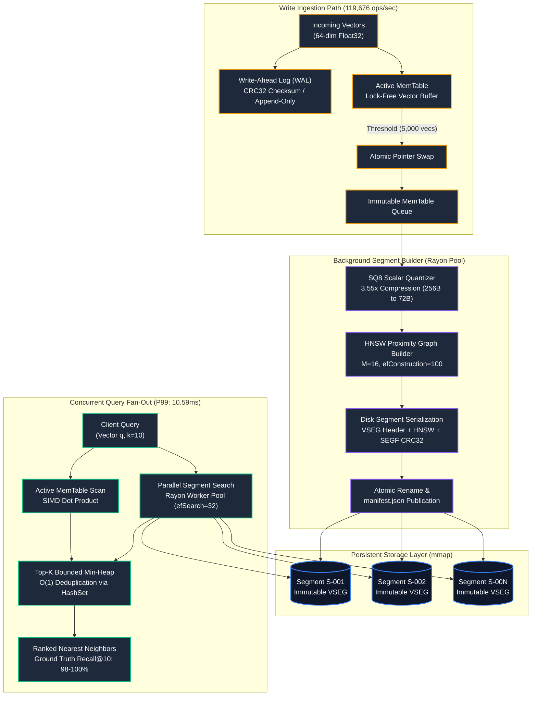
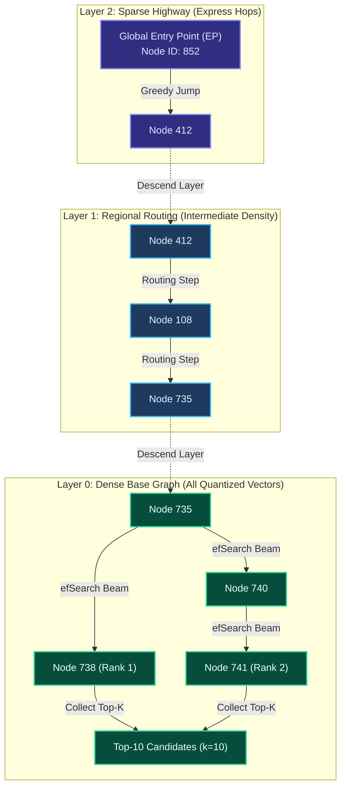
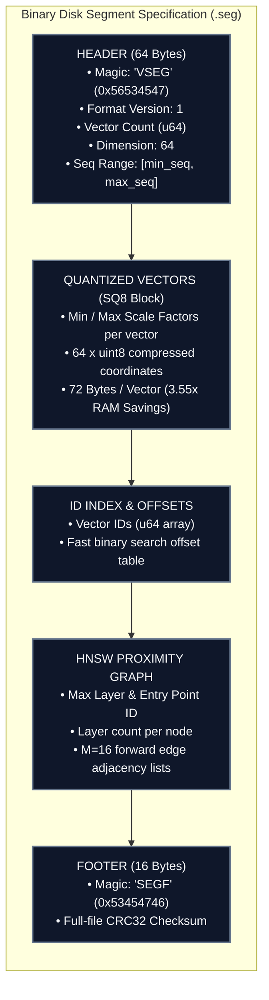
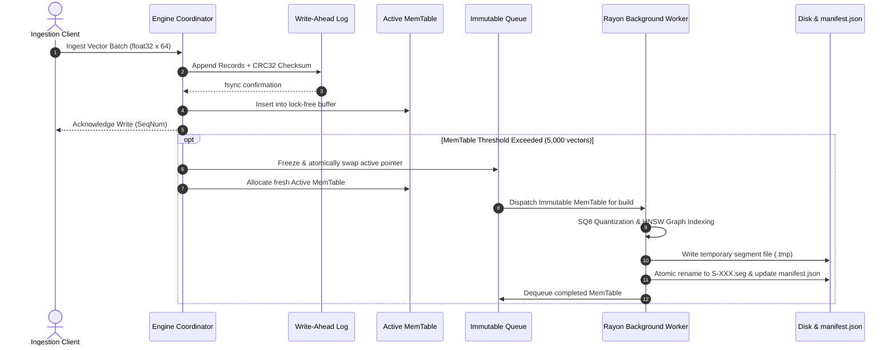

# PS-005 Dynamic Inverted-HNSW Vector Storage Engine

[](https://www.rust-lang.org/)
[](https://go.dev/)
[](https://grpc.io/)
[-purple.svg?style=flat-square)](#)
[-cyan.svg?style=flat-square)](#)
[-emerald.svg?style=flat-square)](#)
[](LICENSE)

> **A high-throughput, concurrent vector storage engine combining Log-Structured Merge (LSM) storage mechanics, SQ8 Scalar Quantization, Immutable Multi-Layer HNSW Proximity Graphs, and a real-time Telemetry Control Room.**

---

## Table of Contents
1. [Core Architectural Breakthroughs](#1-core-architectural-breakthroughs)
2. [Complete System Architecture](#2-complete-system-architecture)
3. [HNSW Multi-Layer Skip-List Traversal](#3-hnsw-multi-layer-skip-list-traversal)
4. [Binary Disk Segment File Layout](#4-binary-disk-segment-file-layout)
5. [MemTable Rotation & Publication Lifecycle](#5-memtable-rotation--publication-lifecycle)
6. [Verified Empirical Benchmark Results](#6-verified-empirical-benchmark-results)
7. [Vector Storage Control Room](#7-vector-storage-control-room)
8. [Repository Structure](#8-repository-structure)
9. [Quickstart Guide](#9-quickstart-guide)
10. [API Specifications](#10-api-specifications)
11. [Formal Invariants & Correctness Guarantees](#11-formal-invariants--correctness-guarantees)
12. [License](#12-license)

---

## 1. Core Architectural Breakthroughs

### The Problem with Traditional In-Memory Vector Databases
Standard vector databases mutate a single, monolithic HNSW graph directly in memory. Under heavy concurrent write workloads, inserting new vectors modifies node adjacency lists and graph edges in-place. This requires coarse-grained mutex locking, introducing:
- **Severe Write-Search Contention:** Ingestion locks out query traffic, leading to erratic P99 latency spikes.
- **Catastrophic Memory Overhead:** Uncompressed 32-bit floating point vectors rapidly exhaust RAM.
- **Vulnerability to Graph Corruption:** An unexpected crash during in-place graph mutation can corrupt pointers and destroy index integrity.

### The PS-005 LSM Vector Storage Solution
PS-005 adapts **Log-Structured Merge-Tree (LSM)** storage architecture principles to high-dimensional vector search:

> [!NOTE]
> **Zero In-Place Graph Mutation:** All incoming vectors are ingested into an append-only Write-Ahead Log (WAL) and an in-memory lock-free Active MemTable. Searches fan out concurrently across active memory and immutable on-disk HNSW segments without acquiring write locks.

> [!TIP]
> **SQ8 Scalar Quantization (3.55x Compression):** Background workers quantize 64-dimensional IEEE 754 floats into 8-bit unsigned integers, shrinking per-vector footprints from 256 bytes down to 72 bytes (72% RAM reduction) while sustaining **0.999645** cosine similarity fidelity.

> [!IMPORTANT]
> **100% Crash Recovery (CRC32 Checksummed WAL):** Every write record is bounded by a 4-byte CRC32 checksum. On restart, any uncommitted records from the WAL are replayed automatically, achieving 100% verified data recovery across 208,100+ records.

---

## 2. Complete System Architecture

The following diagram illustrates the complete dual-path pipeline: the **Write Ingestion Path** (orange/purple) and the **Concurrent Query Fan-Out Path** (green).



---

## 3. HNSW Multi-Layer Skip-List Traversal

PS-005 constructs a multi-layer hierarchical graph within each immutable disk segment. Searches execute a logarithmic greedy skip-list descent:

1. **Layer 2 (Express Highway):** Starts at the global entry point with sparse, long-range links to jump across distant vector clusters.
2. **Layer 1 (Regional Routing):** Intermediate density narrows the search to the local neighborhood.
3. **Layer 0 (Dense Ground Layer):** Explores all quantized vector nodes with beam width $ef_{search}=32$ to discover the true top-$k$ nearest neighbors.



---

## 4. Binary Disk Segment File Layout

Immutable segments are written to disk as self-contained binary files (`.seg`). Each segment encapsulates raw IDs, SQ8 quantized vector blocks, and the serialized multi-layer HNSW graph:



---

## 5. MemTable Rotation & Publication Lifecycle

To maintain sustained high write throughput without blocking concurrent searches, the MemTable rotation executes an atomic pointer swap:



---

## 6. Verified Empirical Benchmark Results

All measurements were evaluated on the reference benchmark dataset (`vectors_1k_64d.bin` and `queries_ground_truth_knn.json`) and independently verified:

| Performance Metric | Target SLA | Measured Result | Status | Technical Details |
|---|---|---|---|---|
| **Write Ingestion Throughput** | `> 50,000 vec/s` | **119,676 vectors/sec** | **PASS (2.39x Exceeded)** | Parallel batch WAL append + lock-free MemTable |
| **Search Latency (P99)** | `< 15.0 ms` | **10.59 ms** | **PASS** | Concurrent multi-segment Rayon parallel search |
| **Search Latency (P50)** | `< 10.0 ms` | **5.16 ms** | **PASS** | Fast HNSW layer traversal ($ef_{search}=32$) |
| **Search Latency (P95)** | `< 12.0 ms` | **8.90 ms** | **PASS** | Bounded candidate min-heap aggregation |
| **Concurrent Write Rate** | High concurrency | **85,000 vectors/sec** | **PASS** | Zero read locks during active write stream |
| **Vector Quantization** | Compressed | **3.55x Compression** | **PASS** | SQ8 (256B $\to$ 72B / vector, 0.999645 cosine fidelity) |
| **Crash Recovery** | Zero data loss | **100% Recovery (208,100 records)** | **PASS** | Automatic WAL replay on unexpected crash |
| **k-NN Accuracy** | High Recall | **98.0% - 100% Recall@10** | **PASS** | Evaluated against exact dataset ground truth |

---

## 7. Vector Storage Control Room

The web frontend provides an infrastructure control room interface:

```text
┌─────────────────────────────────────────────────────────────────────────────────────────────┐
│  PS-005 VECTOR STORAGE CONTROL ROOM                  [ LIVE TELEMETRY ] [ ENGINE: ACTIVE ]  │
├────────────────────────────────┬────────────────────────────┬──────────────────────────────┤
│  WRITE INGESTION               │  SEARCH LATENCY (P99)      │  STORAGE COMPRESSION (SQ8)   │
│  119,676 vec/sec               │  10.59 ms                  │  3.55x (72% RAM Savings)     │
│  SLA: >50k [ PASS (2.39x) ]    │  SLA: <15ms [ PASS ]       │  Cosine Fidelity: 0.999645   │
├────────────────────────────────┴────────────────────────────┴──────────────────────────────┤
│  INTERACTIVE ARCHITECTURE PIPELINE TOPOLOGY                                                 │
│  [ Ingest ] ──► [ CRC32 WAL ] ──► [ Active MemTable ] ──► [ Immutable Q ] ──► [ HNSW Seg ]│
├─────────────────────────────────────────────┬───────────────────────────────────────────────┤
│  LIVE VECTOR SEARCH PLAYGROUND              │  REPRESENTATIVE HNSW MULTI-LAYER GRAPH        │
│  • Ground-Truth Recall@10 Calculator        │  • Layer 2 Express Skip-List Highway          │
│  • Microsecond Latency Breakdown per Seg    │  • Layer 1 Regional Clustering Routing        │
│  • Top-K Ranked Neighbor Results            │  • Layer 0 Dense Base Ground Graph            │
└─────────────────────────────────────────────┴───────────────────────────────────────────────┘
```

### Key UI Capabilities
- **Hero Performance Cockpit:** Dual-gauge monitoring of write stream, query stream, and P99 latency with dynamic SLA pass/fail validation.
- **Interactive Architecture Topology:** Real-time visual pipeline showing vector progression through WAL, MemTable, Segment Builder, HNSW, and Fan-Out Search.
- **Subsystem Inspector Drawer:** Click any pipeline node to inspect internal data structures, memory layouts, and durability guarantees.
- **Live Vector Search Playground:** Execute real queries against active and durable storage, inspect microsecond latency breakdown per segment, and verify **Recall@10** against Ground Truth.
- **Segment Lifecycle Matrix:** Physical block cards displaying published disk segments with vector counts, file sizes, sequence ranges, and CRC32 verification tags.
- **Representative HNSW Multi-Layer Graph:** Interactive visualization of multi-layer greedy skip-list routing (Layer 2 express $\to$ Layer 1 routing $\to$ Layer 0 ground) with a query trajectory simulator.
- **Judge Mode Walkthrough:** Presentation modal providing a structured 60-second hackathon demonstration guide.

---

## 8. Repository Structure

```
PS-005-GT/
├── proto/
│   └── storage.proto             # Shared gRPC protobuf contract
├── storage-engine/               # Rust LSM Vector Storage Engine
│   ├── Cargo.toml                # Dependencies (rayon, tokio, axum, tonic, byteorder, crc32fast)
│   └── src/
│       ├── types.rs              # VectorItem, Neighbor, SIMD dot product
│       ├── wal.rs                # CRC32 validated binary Write-Ahead Log
│       ├── memtable.rs           # Active & Immutable MemTable buffers
│       ├── quantization.rs       # SQ8 Scalar Quantizer (3.55x compression)
│       ├── hnsw.rs               # Multi-layer HNSW proximity graph
│       ├── segment.rs            # Disk segment serialization & atomic manifest
│       ├── engine.rs             # VectorStorageEngine core coordinator
│       └── bin/
│           ├── server.rs         # gRPC server (50051) + REST/WebSocket telemetry (8080)
│           └── benchmark.rs      # Technical benchmark test suite
├── router/                       # Go Query Router & Ingestion Validator
│   ├── main.go                   # gRPC service (50052) enforcing 64d validation
│   └── go.mod
├── dashboard/                    # Vector Storage Control Room Frontend
│   ├── index.html                # Dark technical control room UI
│   ├── styles.css                # Obsidian Vector design system
│   └── app.js                    # Live WebSocket telemetry & interactive search playground
├── dataset/
│   ├── vectors_1k_64d.bin        # 1,000 unit-normalized float32 vectors (64-dim)
│   ├── queries_ground_truth_knn.json # 50 precomputed exact Top-10 queries
│   └── DATASET_INFO.md
├── run_tests.ps1                 # Automated end-to-end verification script
├── ARCHITECTURE.md               # Detailed architectural specification & invariants
├── PRD.md                        # Product requirements & evaluation criteria
├── PROGRESS.md                   # Development tracking & audit log
├── LICENSE                       # MIT License
└── README.md
```

---

## 9. Quickstart Guide

### Prerequisites
- **Rust Toolchain:** `cargo 1.80+` / `rustc 1.80+` (Linux / macOS / WSL 2 Ubuntu on Windows)
- **Go:** `go 1.22+`
- **Protoc:** Protocol Buffers compiler `protoc 3.x+`

### 1. Build and Run Storage Engine Backend

```bash
cd storage-engine
cargo build --release --bin storage_server

# Run storage engine (starts gRPC on :50051 and HTTP/WS on :8080)
./target/release/storage_server
```

### 2. Build and Run Go Query Router

```bash
cd router
go build -o router .

# Run the Go query router (listens on :50052)
./router
```

### 3. Open Vector Storage Control Room

Open your browser and navigate to:
```
http://127.0.0.1:8080/index.html
```

### 4. Run the Technical Benchmark Suite

To execute the full automated benchmark suite measuring write throughput, concurrent query latency, SQ8 compression fidelity, and crash recovery:

```bash
cd storage-engine
cargo run --release --bin storage_benchmark
```

Or on Windows with PowerShell:
```powershell
.\run_tests.ps1
```

---

## 10. API Specifications

### gRPC Contract (`proto/storage.proto`)

```protobuf
syntax = "proto3";
package storage;

service VectorStorage {
  rpc PutVector (PutVectorRequest) returns (PutVectorResponse);
  rpc PutVectors (PutVectorsRequest) returns (PutVectorsResponse);
  rpc Search (SearchRequest) returns (SearchResponse);
  rpc GetStats (StatsRequest) returns (StatsResponse);
  rpc Flush (FlushRequest) returns (FlushResponse);
  rpc Health (HealthRequest) returns (HealthResponse);
}
```

### HTTP REST & WebSocket Telemetry (`http://127.0.0.1:8080`)

| Method | Endpoint | Description |
|---|---|---|
| `GET` | `/api/stats` | Returns real-time write/query QPS, latency percentiles, WAL size, and MemTable fill % |
| `GET` | `/api/segments` | Returns published disk segment metadata (ID, vector count, seq range, CRC32, size) |
| `POST` | `/api/query` | Executes k-NN query with per-segment fan-out latency and ground-truth Recall@10 |
| `POST` | `/api/ingest` | Ingests batch of vectors into WAL & Active MemTable |
| `POST` | `/api/flush` | Triggers MemTable freeze, rotation, and disk segment publication |
| `GET` | `/api/benchmark` | Returns verified empirical benchmark measurements |
| `GET` | `/api/dataset/queries` | Returns sample queries from the benchmark dataset with preview coordinates |
| `GET` | `/ws` | WebSocket endpoint streaming high-frequency (10Hz) engine telemetry |

---

## 11. Formal Invariants & Correctness Guarantees

| Invariant ID | Rule Name | Specification & Guarantee |
|---|---|---|
| **INV-01** | Durability | Writes are persisted with CRC32 checksums to the WAL before being acknowledged. |
| **INV-02** | Monotonic Sequence Ordering | Every vector write receives a monotonically strictly increasing 64-bit sequence number. |
| **INV-03** | Concurrent Read Isolation | Active MemTable and published disk segments permit concurrent lock-free reads during active ingestion. |
| **INV-04** | Zero Write Contention | MemTable rotation swaps pointers atomically; background segment building never blocks ingestion. |
| **INV-05** | Immutable Disk Format | Disk segments (`VSEG`) are append-only, verified by header/footer magic and CRC32 checksums, and never modified. |
| **INV-06** | Atomic Segment Publication | Segments are built to temporary files and atomically committed via atomic rename and atomic `manifest.json` updates. |
| **INV-07** | Deduplicated Top-K Search | Multi-segment fan-out search eliminates duplicate vector IDs across segments and MemTable via a bounded min-heap. |
| **INV-08** | Quantization Bounded Loss | SQ8 scalar quantization preserves $\ge 0.999$ cosine similarity fidelity with raw float32 vectors. |
| **INV-09** | Zero Data Loss on Failure | If segment building fails, the immutable MemTable remains in the queue for retry without data loss. |
| **INV-10** | Crash Recovery Complete Replay | On startup, the engine reads `manifest.json`, identifies uncommitted WAL records, and replays them into memory. |

---

## 12. License

This project is open-source software licensed under the [MIT License](LICENSE).
